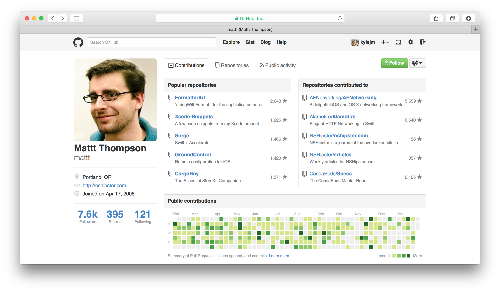

# Git
###  _An introduction_

^ - The VCS Git
- Incredibly important for your group work
- An impressive skill to take right out of Uni
- all companies use some form of VCS
- mostly Git
- One you know git, you can contribute to OS
- This again, looks good
- more change of getting employed

---

---

---

### By the end of this:

 

You should have a rough idea of what Git does

 

You should have the tools and foundation knowledge to learn Git

---

### How are we going to do this:

1. Who is Kyle, why does he know Git?
2. What's Version Control?
2. Why was Git created? - __*Brief History*__
3. The story of a dev team
4. Some basics Git commands
6. Q&A - _but ask whenever a question pops in to your head_

^ History helpful when understanding why Git is made the way it is

---

---

### How are we going to do this:

1. Who is Kyle, why does he know Git?
2. What's Version Control?
2. Why was Git created? - __*Brief History*__
3. The story of a dev team
4. Some basics Git commands
6. Q&A - _but ask whenever a question pops in to your head_

^ History helpful when understanding why Git is made the way it is

---

# [fit] Who's __*Kyle*__? Why is he up there instead of __*Bolotov*__?

^ I'm Kyle McAlpine, I'm in the same year as you guys. 

^ - When I'm not at Uni
- work at Kaldor
- mainly iOS

^ We use Git every day
I've been using it solidly for about a year

---

##What is Version Control?

^ - you've all done it before

^ - It's keeping track of changes
- You make a change, that's version 1

^ - why do this?
- It's often important to be able to go back to old versions
- Think about using cmd+z
- Other features of VCS - BRANCHES
- we'll see later

^ - How can you control versions?
- let's look at some examples
- _next slide_

---

---

 

---

  

---

  

---

# Git

_Keeps track of changes to files in your project_

_Mainly used for Source Code Management_

__*Especially*__ _good at tracking text file changes_

_Allows you to see the differences between versions_

_Allows you to quickly and easily move between versions_

^ Best bit of git is branches
_NEXT SLIDE_

---

---

# __VCS History__

---

^Who knows this guy?

^ Git is massively popular
like I said VCSs have been used since 70s
what came before

---

^ Who knows what this is?

---

 

---

---

## This is Alex

---

Alex wrote a password storage application for iPhone a while ago

---

Image of iPhone 6 came out

^ so he wants to add Touch ID capability to it

---

Alex starts coding away

