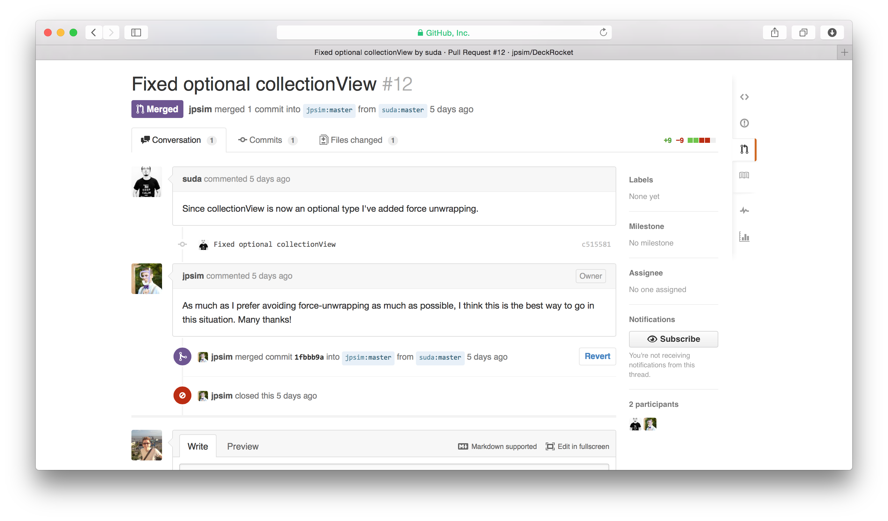
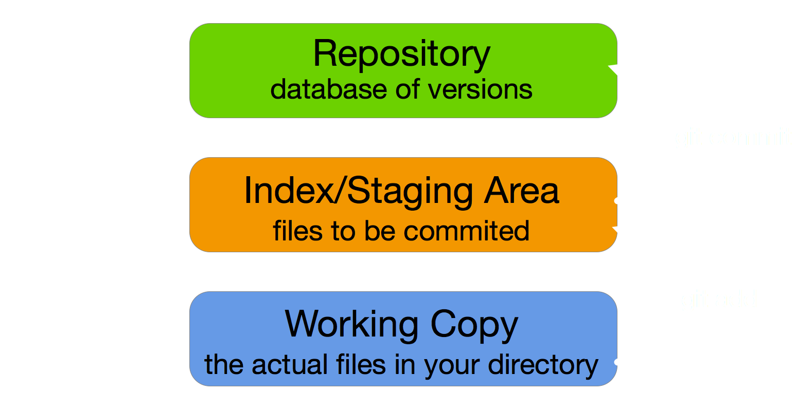
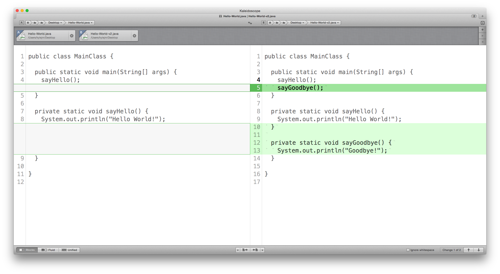
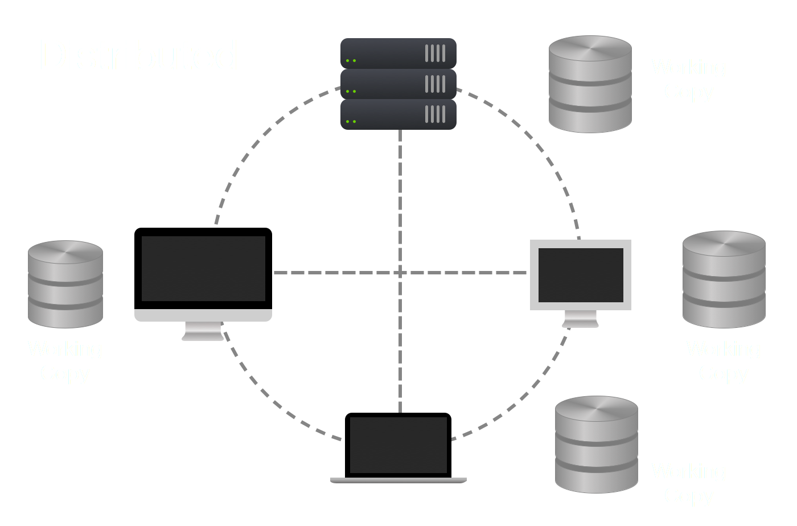

# Git
###  _An introduction_

^ - Git is a VCS

^ - group work

^ - employment (impressive)

^ - open source

^ - GitHub

---

^ Issue tracking

^ comments

^ Pull requests
NEXT SLIDE

---

---

^ Contribution frequency

^ code examples

^ your personal time

^ if time:
if you're into iOS
probably check this guy out

---

^ public - free

^ private paid

^ should use public unless proprietary

---

### By the end of this:

 

You should have a rough idea of what Git does

 

You should have the tools and foundation knowledge to learn Git

^ Go: moments to learn....

---

### How are we going to do this:

1. Who is Kyle, why does he know Git?
2. What's Version Control?
2. Why was Git created? - __*Brief History*__
3. The story of a dev team
4. Some basic Git commands
6. Q&A - _but ask whenever a question pops in to your head_

^ History helpful when understanding why Git is made the way it is

---

---

### How are we going to do this:

1. Who is Kyle, why does he know Git?
2. What's Version Control? What is Git?
2. Why was Git created? - __*Brief History*__
3. The story of a dev team
4. Some basic Git commands
6. Q&A - _but ask whenever a question pops in to your head_

^ History helpful when understanding why Git is made the way it is

---

# [fit] Who's __*Kyle*__? Why is he up there instead of __*Bolotov*__?

^ I'm Kyle McAlpine, I'm in the same year as you guys. 

^ - When I'm not at Uni
- work at Kaldor
- mainly iOS

^ We use Git every day
1 year

---

##What is Version Control?

^ - you've all done it before
- Think about using cmd+z

^ - It's keeping track of changes
- You make a change, that's version 1

^ - why do this?
- rollback - like cmd+z

^ let's explore example

---

---

 

---

  

^ Gets messy as you go

^ Git manages this

^ You can also track others

^ NEXT SLIDE

---

  

^ It's harder to see changes in these

---

## Save to Repo = Commit

---

# Git

^ We know so far

_Keeps track of changes to files in your project_

_Mainly used for Source Code Management_

__*Especially*__ _good at tracking text file changes_

_Allows you to quickly and easily move between versions_

_Allows you to see the differences between versions_

^ Diff - GUI is handy 
DIFF next slide

---

^ BUT
killer feature - BRANCHES
NEXT SLIDE

---

# Branching

^ - Allow you to experiment
- help you work with others

^ - How can you control versions?
- let's look at some examples
- _next slide_

^ lets look at some history
show you how people tried to implement VCS

---

# *VCS History*

^ - Gitmassively popular today
- but VCSs have been used since 70s
- many popular ones
- There are 5 important ones
- that we should look at
- to show good ideas in VCS

^ Anyone recognise the background?

---

# SCCS
### _1972_  •  _Unix_  •  _closed source_ • _Free_
### Saves future changes only

^ Developed by AT&T
better than saving doc over and over (saw earlier)
free with Unix
taught at Uni
took to jobs
became popular

---

# RCS
### _1982_  •  _Unix and other PCs_  •  _open source_
### Saves past changes only

^ Revision Control System
Unix & PC
More intuitive, cleaner syntax
MOST IMPORTANT: faster
LIFO - flipped SCCS around
much faster that SCCS

^Problems SCCS and RCS:
only track on file
not whole project or sets

---

# [fit] Concurrent Version System (CVS)
### _1986_ • _open source_
### Tracks multiple files _•_ Repository

^ REPO 
Work with multiple files
keeps changes in REPO
not changes per file

^ tracks each file individually
share all the files on server
people worling **concurrently**

^ make repo clear

---

# Repository (Repo)

> A place where things are stored and can be found
-- The Cambridge Dictionary

---

# [fit] Subversion (SVN)
### _2000_ • _open source_
### [fit] Non-text files _•_ Directory Snapshotting

^ CVS: tracks files indiv.
SVN: tracks directory
CVS: revision x of given doc
SVN: doc as it appears in revision x
which could be the same as rev y

^ small diff but important
SVN could track name changes
CVS couldn't
Quicker: applys one snapshot for dir
instead of one for every file

^ Stayed popular for a very long time
but one more to look at

---

# BitKeeper
### [fit] _2000_ • _closed source_ • _free community version_
### Distributed VCS

^ first to have DVCS
we'll go over this later

^ Used for Linux Kernel
kinda contravertion
people predicted that it might made non-free
in April 2005, NOT Free
predictions true

---

_SCCS_ - 1970, closed source, _smarter storage_

_RCS_ - 1972, open source, __*even*__ _smarter storage_, _multiple OS_

_CVS_ - 1986, open source, _multiple files_, _repository_

_SVN_ - 2000, open source, _dir snapshotting_, _non-text files_

_BitKeeper_ - 2000, closed source, _Distributed VCS_

---

^Who knows this guy?
he drives dev on Linux

^ didn't like any others VCS out there
like some of their concepts/features
like DVCS in BitKeeper
though her could do better

---

# Git
#### Dev started April, 2005
- _Distributed VCS_
- _Multiple file types_
- _Super fast and reliable_
- _Open source_
- _Compatible with Unix like OS (Linux, Mac OS X, Solaris) and Windows_

^ Created by Linus
two weeks?

^ open source & free
community can contribute
bug fixes
improvements/features
we benegit

^ Popularity exploded
no official stats
GitHub launched 2008
2009 50,000 repos
	 100,000 users

^ 2011 over 2 mil repos
	 1 mil users

---

# GitHub

Launched _2008_

By _2009_ had _50,000 repos_ and _100,000 users_

---

# GitHub

Launched _2008_

By _2009_ had _50,000 repos_ and _100,000 users_

## By _2011_ had over _2 MILLION repos_ and _1 MILLION users_

---

# [fit] Distributed Version Control

^ Linus' favourite feature of BK
The 5 other RCSs used a centralised

^ centralised - stored in one place

^ distributed - stored in many places

^ Git stores files differently

---

^ user checkouts file
^ edits
^ to save has to push up

---

^ Each has own copy
^ copy -> Working Copy
^ no repo depends on the other
^ Git tracks change sets, not versions
^ means that each repo can be different
^ to illustrate this
^ next slide

---

---

---

# [fit] Discrete change sets, not deltas (differences)

Repo 1: _A_, _B_, _C_, _D_, _E_, _F_, _G_

---

# [fit] Discrete change sets, not deltas (differences)

Repo 1: _A_, _B_, _C_, _D_, _E_, _F_, _G_

Repo 2: _A_, _B_, _C_, _E_, _G_

---

# [fit] Discrete change sets, not deltas (differences)

Repo 1: _A_, _B_, _C_, _D_, _E_, _F_, _G_

Repo 2: _A_, _B_, _C_, _E_, _G_

Repo 3: _A_, _C_, _G_

Repo 4: _B_, _D_, _E_, _F_, _G_

---

# Benefits of DVCS

- _Faster_
- _No network access required_
- _No single failure point_
- _Devs can work independently_

### It also encourages people to _Fork_ Open Source project

---

---

# [fit] _Story of a_
# [fit] __*Dev Team*__

---

 ![inline] (images/password-app.png)

---

---

^ By adding Touch ID
mucks up password

---

^ Simply fixes it by rolling back

---

---

---

^ Touch on MERGE CONFLICTS

---

---

^ Works for single dev too
branch for feature
branch for experiment

---

^ show GUI throughout

^ show add
^ show commit
^ show diff

^ show checkout

^ NEXT SLIDE

---

^ Back to terminal
show git checkout

---

# Installing Git

_Mac_ - Prompts install on first use

_Windows_  - git-scm.com

---

## _Helpful sites_

git-scm.com (Pro Git Book)

github.com

atlassian.com/git

stackoverflow.com

---

# __*Q&A*__ :raising_hand:

##  

### @kylejm_

###  

### Feedback   :inbox_tray:   k@kylejm.io

^ important to learn Git
^ important to learn Cmd line
^ GUI Where needed
^ Use Git for almost everything
^ this presentation is on GitHub

